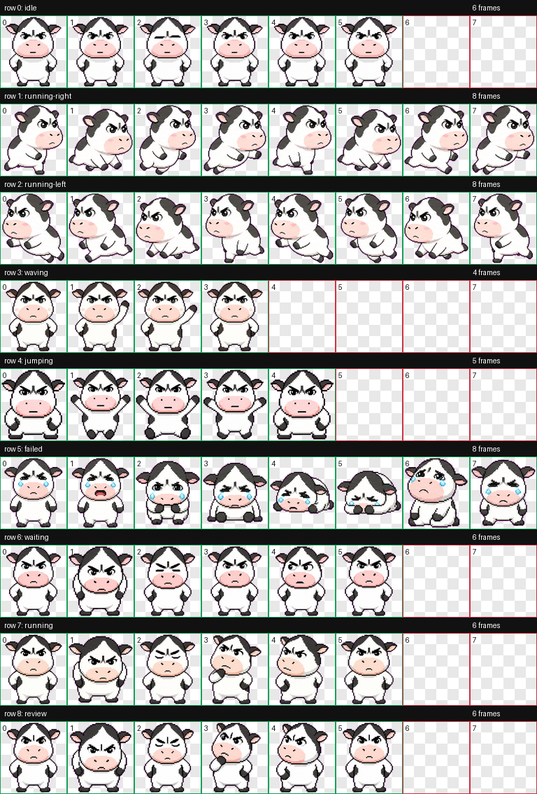

# Moomoo

一只自定义 Codex pet（哞哞 / Moomoo），已打包供本地安装，并附带完整的生成素材存档。

## Pet

### 哞哞（Moomoo）

哞哞是一只根据参考照片生成的 Q 版奶牛 Codex 数字宠物，拥有圆滚滚的大头、黑白花纹、粉色口鼻、短小四肢、深色小蹄子，以及浓眉大眼的倔强表情。它采用紧凑的 Codex 数字宠物风格：近似像素艺术的造型、粗深色轮廓、有限色板、平涂着色，以及透明背景的最终 spritesheet。

包文件：

- `pets/moomoo/pet.json`
- `pets/moomoo/spritesheet.webp`



## 仓库结构

```text
pets/
  moomoo/
    pet.json
    spritesheet.webp
runs/
  moomoo/
    decoded/
    final/
    frames/
    prompts/
    qa/
    references/
    imagegen-jobs.json
    pet_request.json
```

`pets/` 目录包含可直接使用的 Codex 宠物包。`runs/` 目录包含用于创建哞哞的原始参考素材、提示词、生成的行条带、提取的帧、最终精灵图集和 QA 报告。

## 使用方法

将宠物包文件夹复制到本地 Codex 宠物目录：

```bash
mkdir -p ~/.codex/pets
cp -R pets/moomoo ~/.codex/pets/moomoo
```

复制完成后，重启或刷新 Codex 以使新宠物生效。

每个包文件夹必须包含以下两个文件：

- `pet.json`
- `spritesheet.webp`

## QA 素材

检查哞哞的最终输出时，请查阅以下文件：

- `runs/moomoo/qa/contact-sheet.png`：展示所有动画行和帧。
- `runs/moomoo/qa/review.json`：包含帧提取和组件检查结果。
- `runs/moomoo/final/validation.json`：包含精灵图集验证结果。
- `runs/moomoo/final/spritesheet.webp`：最终透明 Codex 图集。

Codex 图集的预期尺寸为 `1536x1872`，由 8x9 网格中的 `192x208` 单元格构成。

## 备注

- `running-left` 由 `running-right` 镜像生成，因为哞哞没有方向特定的文字、标志或不应反转的单侧配件。
- 生成的宠物采用紧凑的 Codex 数字宠物风格：近似像素艺术的造型、粗深色轮廓、有限的色板、平涂单色着色，以及透明背景的最终精灵图集。
- 预览视频因本机缺少 `ffmpeg` 已跳过；最终宠物包、联系表和验证文件已正常生成。
